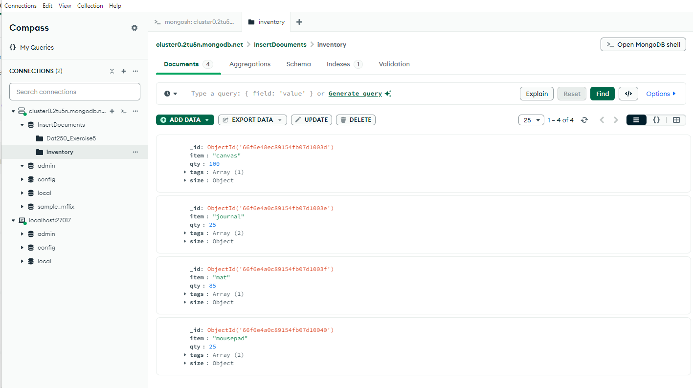
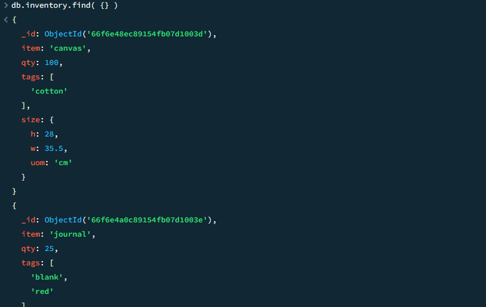
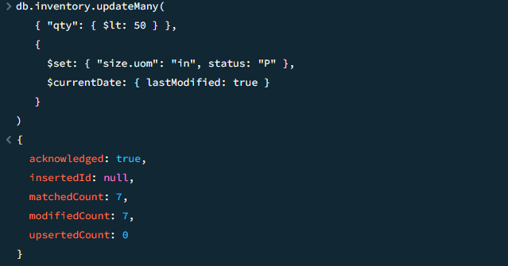
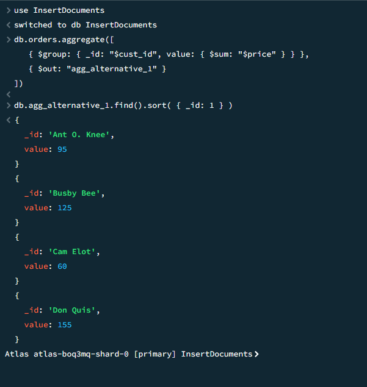
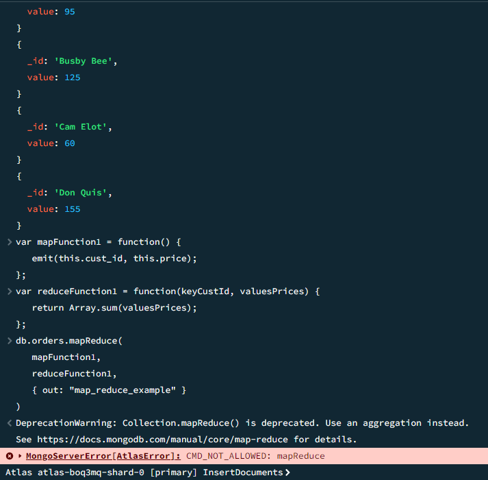
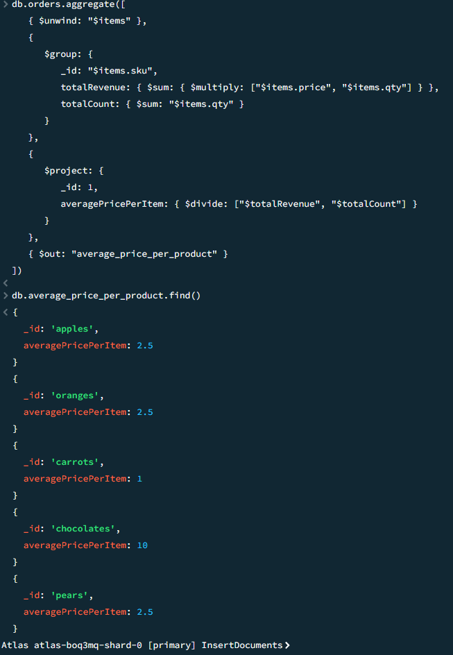

Screenshots:
1. Validation of installation 
2. Results Experiment 1:
Insert Documents: 
Query Documents: 
Update Documents: 
Delete Documents: 
3. Experiment 2:
mapReduce is deprecated, so i could not follow the tutorial completely and had to use aggregation instead.

I created an operation that finds the average price for each item.

This function is useful as it lets us see which products are sold at which prices